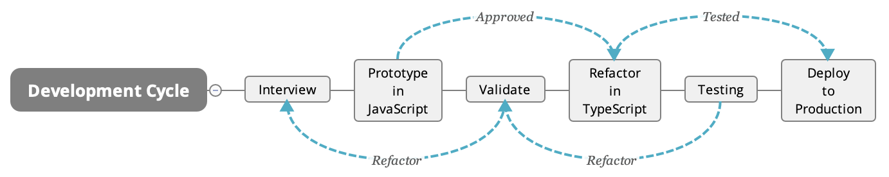

# Demerzel

This repository contains basic setup, to quickly bootstrap new project for a web application.

The intention is also, to provide opinionated list of technologies, that can be used to create modern, sophisticated web applications, that are and robust easy to maintain.

## Features

You will get isomorphic, type safe, mobile ready, server side rendered [SSR], progressive web application [PWA], with pre-configured testing, code linting and prettifying. Just wow :tada:!

## Monorepo

The repository has a monorepo structure. The idea behind such structure, is to have a package architecture, that simplifies the process of developing modular software, by allowing for better code sharing, simpler dependency management, and build process optimization. Moreover, it helps to manage:

- Cross dependencies.
- Tests configuration.
- Linting configuration.
- Deployment scripts.

The support for such an architecure comes with [workspaces](https://yarnpkg.com/lang/en/docs/workspaces) in Yarn package manager, and it is extended with [Lerna](https://github.com/lerna/lerna), which offers additional fetures on top of workspaces. Some background information can be found in the article: [Monorepos in the Wild](https://medium.com/@maoberlehner/monorepos-in-the-wild-33c6eb246cb9).

## Vesion Control

- [GitFlow](https://datasift.github.io/gitflow/IntroducingGitFlow.html) for branching model.
- [Semantic Versioning](https://semver.org) for versioning packages.

# Packages

The modules are placed inside `packages` directory:

- **components**: library of React components. Uses [styleguidist](https://github.com/styleguidist/react-styleguidist) for presentation.
- **config**: sharable build configuration for [Webpack](https://webpack.js.org) bundler.
- **utils**: utils and tools.
- **webapp**: Web Application.

Each module in the `packages` directory should be treated as a standalone `npm` package, with it's own scripts and depenencies.

For most of the modules, one should be able to run at least `yarn start` and `yarn build` command.

Some modules are marked as `private` in their local `package.json` file, which means, that they can be excluded from the workflow when using Lerna.

# Installation

_Note: It is recommended to update Node.js to it's recent version._

Clone the repository:

```sh
git clone https://github.com/schabluk/demerzel.git
```

Install and link all dependencies, then build all modules (_note, that Lerna will create an appropriate build order_):

```sh
cd demerzel
yarn install && yarn boot && yarn build
```

Go to the `webapp` and lauch the prototype in `development` mode.

```sh
cd packages/webapp/
yarn dev
```

# Development cycle

Preferably using Timeboxing.

Prototyping in JavaScript [JS], delivering in TypeScript [TS]. Tests are written for validated components only.



## Development Environment

- [Visual Studio Code](https://code.visualstudio.com) - for code editing. Recomended plugins:
  - Plugin list
- [CodeSandbox](https://codesandbox.io) - for live collaboration and quick code sharing.

## Code Structure

https://gist.github.com/ryanflorence/daafb1e3cb8ad740b346?
https://gist.github.com/jamesknelson/432f00af5522ea07cbb39990a8105e0c?

## Code Quality

The code quality is assured with [ESLint](https://eslint.org)/[TSLint](https://palantir.github.io/tslint) and [Prettier](https://prettier.io). The settings for code linting ([JS](.eslintrc.js)/[TS](tslint.json)) and [formating](.prettierrc) are higly opinionated, but they must be followed to keep consistency across the codebase.

The top-level [package.json](package.json) is configured with [husky](https://github.com/typicode/husky) and [lint-staged](https://github.com/okonet/lint-staged), to prevent from commiting baddly written, or erroneous code to the repository.

ToDo:

- Add test runner to lint-staged, to prevent from commiting code with failing tests.

## Testing

Tests are made with [React Testing Library](https://testing-library.com/react) for React components, and they are executer with [Jest](https://jestjs.io/) test runner.

The main Jest configuration file is located in the top-level project directory: [jest.config.js](jest.config.js), however, packages can extend this configuration from their local directory, like the [webapp](packages/webapp/jest.config.js).

Here are some example tests:

- for [JavaScript](packages/webapp/modules/Foo.test.jsx) files.
- for [TypeScript](packages/webapp/modules/Bar.test.tsx) files.

ToDo:

- setup testing for Node.js modules.
- setup end-to-end tests in Cypress.
- setup testing for REST end-points.

## Metrics

To get insight into application's performance and quality, it should be additionally tested against [Lighthouse](https://developers.google.com/web/tools/lighthouse), which can be done in [Chrome DevTools](https://developers.google.com/web/tools/lighthouse/#devtools).

# Architecture

The main principle to follow, to achieve modular architecture, is Separation of Concerns.

The system has to have a layered structure, with clear separation between Presentation Layer, Business Logic, and Persistency Layer.


## Front End

The Front-End code is isomorphic, meaning, it will run on both, the client and the server.

_Note_: For a complete list of technical requirements for a Web Application, follow the [Front End Checklist](https://github.com/thedaviddias/Front-End-Checklist).

### User Interface

#### Styling

Components styling is done with SCSS, CSS Modules, Styled Components, adopting CSS Grid for responsive layout.

### State Management

### State Charts

## Back End

- Data Storage: [MongoDB](https://www.mongodb.com)
- Headless CMS: [Strapi](https://strapi.io)
- Chat Service: [Zulip](https://github.com/zulip/zulip)

### MongoDB

?

## Progressive Web Apps

# Solutions

## User Input

- Use DraftJS instead of `textarea`
- react-jsonschema-form

## Access Control

## Business Logic

# Documentation

## Markdown

# Workflow commands

Here are some commands for performing daily tasks in monorepo. To learn about all the commands offered by Lerna, see the [github docs](https://github.com/lerna/lerna).

**Listing all packages (except for private):**

To see which packages are visible to lerna by default, use `list` sub-command.

```sh
lerna ll
```

or, to print the output as JSON:

```sh
lerna ll --json
```

**Installing top-level dependency:**

There are few cases for installing top-level dependecies. Usually, these are related to linting, testing, or git hooks (husky), which are set up globally for the whole repository. To install a top-level dependency, one must use **-W** option (ignores workspaces).

```sh
yarn add --dev -W eslint
```

The `--dev` option will work in the same way as with yarn/npm - installing the package as `devDependency`.

**Installing cross dependencies:**

To install a dependency into _all_ packages withing monorepository, run:

```sh
lerna add --no-private --dev @babel/core
```

One should always use `--no-private` option, to exclude private packages from installation, as they might have their own specific versions of the package being installed.

**Installing scoped dependencies:**

To install a dependency into a _single_ package within monorepository, run:

```sh
lerna add --scope=components react-powerplug
```

The above command will install `react-powerplug` library into `components` package.

**Note:** It is also possible, to install local packages, _as they were already published_ into npm. The following command, will install local `utils` package into local `pqleditor` package.

```sh
lerna add --scope=webapp utils
```

The way it works, is Lerna will install the `utils` package into the top-level `node_modules` directory, treating it as a **compiled NPM module**. It means, that in order for it to work, **the package need's to be built** with `yarn build` command, executed either from top-level directory, or from local package directory.

**Removing dependencies:**

To remove dependecy from all packages run:

```sh
lerna exec -- yarn remove babel-core
```

The `lerna exec` command, allows to run a specific command in every package within monorepo. To lern more about this command see the [docs](https://github.com/lerna/lerna/tree/master/commands/exec#readme).

**Building:**

To build all packages inside monorepo, run:

```sh
lerna run --no-private build
```

This command will run `build` script (if existst), in every package within monorepo, so the `build` commands are defined per-package.

**Cleaning:**

In monorepo, all cross-dependencies will be installed into the top-level `node_modules` directory, however some packages, that are installed only for single package within monorepo, will be installed into it's local `node_modules` folder.

To cleanup `node_modules`, `dist` and `build` folders in `packages/*` directory, run:

```sh
lerna clean
```
